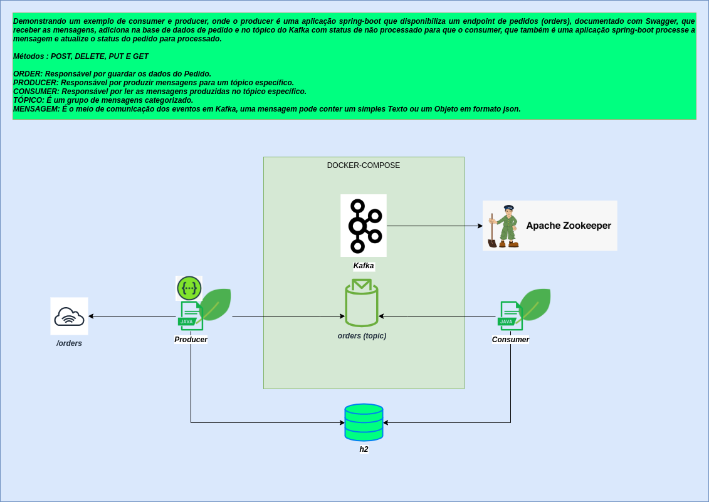

### **HISTÓRICO DE ELABORAÇÃO**
| **Data**     | **Versão**   | **Autor**                      | **Descrição da Alteração** |
|:------------:|:------------:|:------------------------------:|:--------------------------:|
| _17/01/2022_ | _01_         | Sander Bezerra  | _Criação do documento_   
| _07/02/2022_ | _02_         | Sander Bezerra  | _Atualização_    
---

### **1 Contexto**
Projeto "Desafio Spring Boot". Faz parte do Fast-Track Spring-Boot com a finalidade de apresentar os conceitos básicos de Microserviços.

### **2 Escopo**
O Desafio proposto é um [CRUD] de pedidos que fará interação com o Kafka para atualização de status conforme arquitetura proposta abaixo.

### **3 Arquitetura**

### **4. Swagger**

> [swagger.yaml](src/main/resources/static/documents/swagger.yaml)
